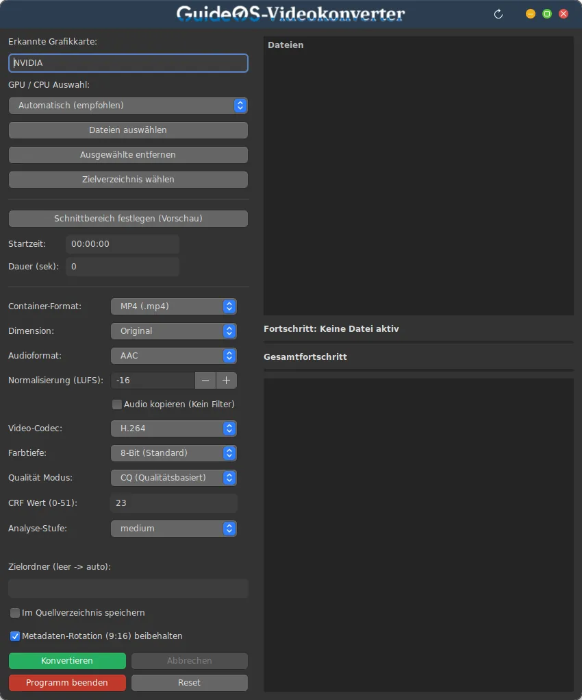
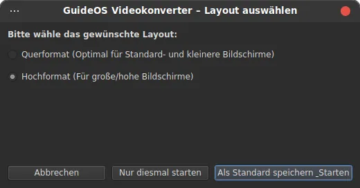
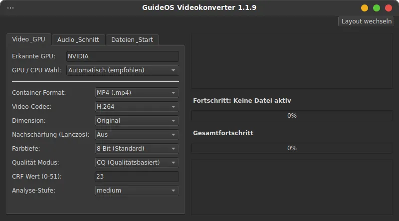
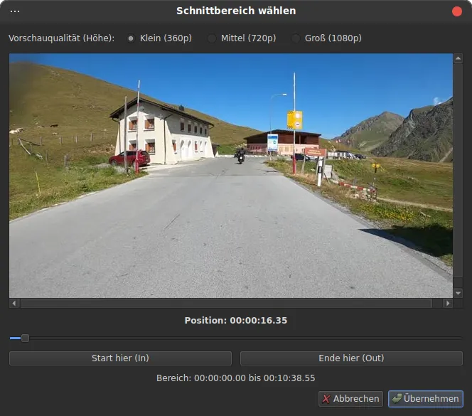

## Guideos-Videokonverter
Der **GuideOS-Videokonverter** ist ein auf Linux ausgerichter Video-Konverter mit moderner PyQt6-Oberfläche.   
Er erleichtert das schnelle Umwandeln, Schneiden und Komprimieren von Videoclips in platzsparende Formate.   
Zur Maximierung der Verarbeitungsgeschwindigkeit wird vorhandene Grafikhardware (GPU) voll ausgenutzt.

<div style="display:flex; gap:10px;">
  
  
  
</div>

### Key Features auf einen Blick

✅ **Hardware-Beschleunigung**: NVIDIA (NVENC), AMD (VAAPI/AMF), Intel (QuickSync/VAAPI) sowie CPU (Software-Fallback)\
✅ **Container & Codecs**: MP4, MKV & WebM | Video: H.264, H.265 (HEVC), VP9 & AV1\
✅ **Audio-Anpassungen**: Codec-Wechsel (AAC, Opus, FLAC, PCM), Audio-Copy (1:1 ohne Qualitätsverlust, ideal für 5.1 Surround)   
✅ **Lautstärke-Normalisierung** (LUFS nach EBU R128)\
✅ **Qualitätssteuerung**: CRF/CQ (Qualitätsstufe), feste Bitrate oder direkte Ziel-Dateigröße (MB)\
✅ **Skalierung & Nachschärfung**: High-Quality Upscaling (720p bis 4K via Lanczos) inkl.   \
    konfigurierbarem Unsharp-Filter\
✅ **Farbtiefe & Hochformat**: Unterstützung für 8-Bit & 10-Bit sowie Erhalt von Smartphone-Rotationsflags (9:16)\
✅ **Schnittfunktion**: Visuelle Festlegung von Startzeit und Dauer über ein integriertes Vorschau-Modul\
✅ **Batch-Verarbeitung**: Stapelverarbeitung mehrerer Dateien per Drag & Drop mit Fortschrittsanzeige & Abbruchfunktion

***
### Funktionsübersicht

#### 🚀 Enkoder-Unterstützung
* **NVIDIA**: Hardwarebeschleunigung über NVENC
* **AMD**: Hardwarebeschleunigung über VAAPI / AMF
* **Intel**: Hardwarebeschleunigung über VAAPI / QuickSync
* **CPU**: Softwarebasierte Kodierung (Fallback bei inkompatiblen Clipsegmenten)

#### 📽 Videoformate & Codecs
* **Container**: MP4 (`.mp4`), Matroska (`.mkv`), WebM (`.webm`)
* **Video-Codecs**: H.264 (AVC), H.265 (HEVC), VP9, AV1 oder Modus *"Nur Audio"*
* **Farbtiefe**: 8-Bit (Standard) & 10-Bit (HDR/High Quality)
* **Smartphone-Rotation**: Automatische Beibehaltung von 9:16 Flags gegen ungewollte Verzerrungen

#### 🎵 Audioeinstellungen
* **Stream Copy (Audio-Copy)** 🆕: Übernahme der Audiospur ohne Neukodierung (spart Zeit und erhält 5.1/7.1 Sound 1:1)
* **Audio-Codecs**: AAC, Opus (Standard für WebM), FLAC (Lossless) und PCM (16-Bit)
* **Lautstärke-Normalisierung** 🆕: Integrierte EBU R128 Loudness-Normalisierung (-30 bis -5 LUFS, ideal für Web & TV)

#### 🎚 Qualität & Bitrate
* **CQ / CRF**: Qualitätsbasierte Kodierung mit konfigurierbaren Werten
* **Bitrate**: Manuelle Festlegung der Zielbitrate in kbit/s
* **Zieldateigröße**: Automatische Bitratenberechnung basierend auf einer gewünschten Ziel-Megabyte-Zahl

#### 📐 Auflösung, Skalierung & Schärfe
* **Auflösungen**: Original, 720p (HD), 1080p (Full HD), 1440p (2K), 2160p (4K)
* **Skalierung**: FFmpeg Lanczos-Filter für maximale Schärfe beim Up-/Downscaling
* **Unsharp-Filter** 🆕: Integrierter Nachschärfefilter (*Leicht*, *Mittel*, *Stark*) zur Optimierung skalierten Bildmaterials

---

### 🔍 Modul: Video-Vorschau & Schnittbereich (video_preview.py)
<div style="display:flex; gap:10px;">
  
</div>

**Kernfunktionen:**
* **Visuelles Scrubbing**: Flüssiges Spulen und Ansteuern genauer Videopositionen per PyQt6-Slider.
* **In/Out-Point Definition**: Start- und Endpunkte können direkt in der Vorschau gesetzt werden. Die resultierende Dauer wird automatisch berechnet und ins Hauptfenster übernommen.
* **Ressourceneffizienz**: Multithreaded Frame-Extraktion verhindert ein Einfrieren der Benutzeroberfläche (GUI-Lag) beim schnellen Suchen.

---
## 🔧 Installation

### 1. Download des `.deb` Packages, von der **[Releases](https://github.com/GuideOS/guideos-videokonverter/releases)** Section in diesem Repository
### 2. Als DEB-Paket bauen und installieren:
   \
Dazu erstelle ein beliebiges Verzeichnis, öffne darin das Terminal und führe folgende Schritte aus: 


#### Repository klonen
```bash
git clone [https://github.com/GuideOS/guideos-videokonverter.git](https://github.com/GuideOS/guideos-videokonverter.git)
cd guideos-videokonverter
```
   
#### DEB-Paket bauen
```bash
dpkg-buildpackage -us -uc
```
    
#### Paket installieren
```bash
sudo dpkg -i ../guideos-videokonverter_*.deb
sudo apt-get install -f  # Fehlende Abhängigkeiten automatisch auflösen
```
